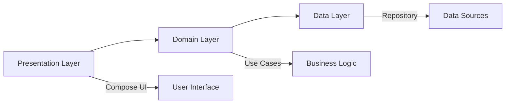

<div align="center">

# JectPrint - Modern Android Clean Architecture
### A Production-Ready Android Blueprint with Jetpack Compose

[](https://developer.android.com/)
[](https://kotlinlang.org/)
[](https://developer.android.com/jetpack/compose)
[](LICENSE)

<!-- <p align="center">
  
</p> -->

</div>

## 📑 Table of Contents

- [Overview](#-overview)
- [Key Features](#-key-features)
- [Architecture](#%EF%B8%8F-architecture)
- [Tech Stack](#%EF%B8%8F-tech-stack)
- [Project Structure](#-project-structure)
- [Setup & Installation](#-setup--installation)
- [Development Guide](#-development-guide)
- [Testing Strategy](#-testing-strategy)
- [Build & Release](#-build--release)
- [Contributing](#-contributing)
- [License](#-license)

## 📝 Overview

JectPrint demonstrates modern Android development practices through a clean, scalable, and maintainable architecture. Built with Jetpack Compose and following SOLID principles, this project serves as a blueprint for production-grade Android applications.

### Why JectPrint?

- ✅ Production-ready architecture
- ✅ Modern UI with Jetpack Compose
- ✅ Clean and maintainable codebase
- ✅ Comprehensive testing strategy
- ✅ Scalable single-module approach
- ✅ Best practices implementation

## 🌟 Key Features

### Technical Features

- **Clean Architecture Implementation**
  - Clear separation of concerns
  - Independent layers
  - Testable components
  - Dependency inversion

- **Jetpack Compose UI**
  - Material Design 3 components
  - Custom composable functions
  - Theme management
  - Responsive layouts

- **State Management**
  - Unidirectional data flow
  - Predictable state updates
  - Error handling
  - Loading states

- **Data Management**
  - Offline-first approach
  - Data synchronization
  - Cache strategy
  - Error handling

### App Features

- User Authentication & Management
- Data Synchronization
- Offline Support
- Theme Customization
- Error Handling & Recovery
- Performance Optimization

## 🏗️ Architecture

### Clean Architecture Overview



### Layer Details

#### 1. Presentation Layer (`com.ziax.jectprint.presentation`)

```kotlin
presentation/
├── components/          # Reusable UI components
│   ├── CommonButton.kt
│   ├── CommonTextField.kt
│   └── LoadingIndicator.kt
├── features/
│   ├── main/           # Main feature implementation
│   └── detail/         # Detail feature implementation
└── theme/              # App theming
```

**Key Components:**
- ViewModels with UiState
- Composable Functions
- Navigation
- State Management

#### 2. Domain Layer (`com.ziax.jectprint.domain`)

```kotlin
domain/
├── model/              # Business models
├── repository/         # Repository interfaces
└── usecase/           # Business logic
```

**Responsibilities:**
- Business Logic
- Use Case Implementation
- Domain Model Definition
- Repository Interface Definition

#### 3. Data Layer (`com.ziax.jectprint.data`)

```kotlin
data/
├── local/             # Local storage
│   ├── dao/
│   └── entity/
├── remote/            # Network operations
│   ├── api/
│   └── dto/
└── repository/        # Repository implementations
```

**Components:**
- Repository Implementations
- Data Mapping
- Cache Strategy
- Error Handling

## 🛠️ Tech Stack

### Core Technologies

| Category | Technologies |
|----------|-------------|
| **Language** | Kotlin 1.9.0 |
| **UI Framework** | Jetpack Compose 2024.01.00 |
| **Architecture** | MVVM, Clean Architecture |
| **Dependency Injection** | Dagger Hilt |
| **Asynchronous Programming** | Coroutines, Flow |
| **Local Storage** | Room Database |
| **Networking** | Retrofit, OkHttp |
| **Testing** | JUnit5, Mockk, Turbine |

### Development Tools

- **IDE**: Android Studio Hedgehog | 2023.1.1
- **Build System**: Gradle Kotlin DSL
- **Version Control**: Git
- **CI/CD**: GitHub Actions
- **Code Quality**: ktlint, Detekt

## 📁 Project Structure

```
app/
├── data/                  # Data Layer
│   ├── local/
│   │   ├── dao/          # Database Access Objects
│   │   │   └── UserDao.kt
│   │   ├── entity/       # Database Entities
│   │   │   └── UserEntity.kt
│   │   └── source/       # Local Data Sources
│   │       └── LocalDataSource.kt
│   ├── remote/
│   │   ├── api/          # API Services
│   │   │   └── ApiService.kt
│   │   ├── dto/          # Data Transfer Objects
│   │   │   └── UserDto.kt
│   │   └── source/       # Remote Data Sources
│   │       └── RemoteDataSource.kt
│   └── repository/       # Repository Implementations
│       └── UserRepositoryImpl.kt
├── di/                   # Dependency Injection
│   ├── component/
│   │   └── AppComponent.kt
│   └── module/
│       ├── DatabaseModule.kt
│       ├── NetworkModule.kt
│       └── RepositoryModule.kt
├── domain/              # Domain Layer
│   ├── model/
│   │   └── User.kt
│   ├── repository/
│   │   └── UserRepository.kt
│   └── usecase/
│       ├── GetUserUseCase.kt
│       └── UpdateUserUseCase.kt
└── presentation/        # Presentation Layer
    ├── components/
    │   ├── CommonButton.kt
    │   ├── CommonTextField.kt
    │   └── LoadingIndicator.kt
    ├── feature/
    │   ├── main/
    │   │   ├── MainActivity.kt
    │   │   ├── MainViewModel.kt
    │   │   └── components/
    │   └── detail/
    │       ├── DetailActivity.kt
    │       ├── DetailViewModel.kt
    │       └── components/
    └── theme/
        ├── Color.kt
        ├── Theme.kt
        └── Type.kt
```

## 🚀 Setup & Installation

### Prerequisites

```toml
[versions]
androidStudio = "2023.1.1 or later"
kotlin = "1.9.0"
jdk = "17"
androidSdk = "34"
```

### Step-by-Step Installation

1. **Clone the Repository**
   ```bash
   git clone https://github.com/A-fauzi/jectprint.git
   cd jectprint
   ```

2. **Environment Setup**
   ```bash
   # Copy environment template
   cp .env.template .env
   
   # Configure your API keys
   nano .env
   ```

3. **Build Configuration**
   ```bash
   # Debug build
   ./gradlew assembleDebug
   
   # Release build
   ./gradlew assembleRelease
   ```

## 👨‍💻 Development Guide

### Coding Standards

We follow [Android Kotlin Style Guide](https://developer.android.com/kotlin/style-guide) with additional customizations:

```kotlin
// Example of proper code style
class UserViewModel @Inject constructor(
    private val getUserUseCase: GetUserUseCase
) : ViewModel() {
    private val _uiState = MutableStateFlow<UserState>(UserState.Initial)
    val uiState: StateFlow<UserState> = _uiState.asStateFlow()
    
    fun loadUser(id: String) {
        viewModelScope.launch {
            _uiState.value = UserState.Loading
            try {
                val user = getUserUseCase(id)
                _uiState.value = UserState.Success(user)
            } catch (e: Exception) {
                _uiState.value = UserState.Error(e.message)
            }
        }
    }
}
```

### Git Workflow

```bash
# Create feature branch
git checkout -b feature/new-feature

# Commit changes
git commit -m "feat: add new feature"

# Push changes
git push origin feature/new-feature
```

## 🧪 Testing Strategy

### Test Categories

1. **Unit Tests** (`src/test/`)
   ```kotlin
   class UserViewModelTest {
       @Test
       fun `when loading user, should update state accordingly`() {
           // Test implementation
       }
   }
   ```

2. **Integration Tests**
   ```kotlin
   class UserRepositoryTest {
       @Test
       fun `repository correctly integrates with data sources`() {
           // Test implementation
       }
   }
   ```

3. **UI Tests** (`src/androidTest/`)
   ```kotlin
   class MainScreenTest {
       @Test
       fun mainScreen_displaysUserData() {
           // Test implementation
       }
   }
   ```

### Running Tests

```bash
# Unit tests
./gradlew test

# UI tests
./gradlew connectedAndroidTest

# All tests
./gradlew testDebug
```

## 📦 Build & Release

### Build Types

```groovy
android {
    buildTypes {
        debug {
            applicationIdSuffix ".debug"
            debuggable true
        }
        release {
            minifyEnabled true
            proguardFiles getDefaultProguardFile('proguard-android-optimize.txt')
        }
    }
}
```

### Release Process

1. Version Bump
   ```bash
   ./gradlew bumpVersion -PversionBump=patch
   ```

2. Generate Release Notes
   ```bash
   ./gradlew generateReleaseNotes
   ```

3. Build Release
   ```bash
   ./gradlew assembleRelease
   ```

## 📱 Screenshots & Demo

<div align="center">
<table>
  <tr>
    <td></td>
    <td></td>
    <td></td>
  </tr>
  <tr>
    <td align="center">Main Screen</td>
    <td align="center">Detail Screen</td>
    <td align="center">Profile Screen</td>
  </tr>
</table>
</div>

## 🤝 Contributing

We welcome contributions! Please follow these steps:

1. Fork the repository
2. Create your feature branch:
   ```bash
   git checkout -b feature/amazing-feature
   ```
3. Commit your changes:
   ```bash
   git commit -m 'feat: add amazing feature'
   ```
4. Push to the branch:
   ```bash
   git push origin feature/amazing-feature
   ```
5. Open a Pull Request

### Commit Convention

We follow [Conventional Commits](https://www.conventionalcommits.org/):

- `feat:` New features
- `fix:` Bug fixes
- `docs:` Documentation changes
- `style:` Code style changes
- `refactor:` Code refactoring
- `test:` Adding or modifying tests
- `chore:` Maintenance tasks

## 📄 License

```
MIT License

Copyright (c) 2024 Zi

Permission is hereby granted, free of charge, to any person obtaining a copy
of this software and associated documentation files (the "Software"), to deal
in the Software without restriction, including without limitation the rights
to use, copy, modify, merge, publish, distribute, sublicense, and/or sell
copies of the Software, and to permit persons to whom the Software is
furnished to do so, subject to the following conditions:

The above copyright notice and this permission notice shall be included in all
copies or substantial portions of the Software.

THE SOFTWARE IS PROVIDED "AS IS", WITHOUT WARRANTY OF ANY KIND, EXPRESS OR
IMPLIED, INCLUDING BUT NOT LIMITED TO THE WARRANTIES OF MERCHANTABILITY,
FITNESS FOR A PARTICULAR PURPOSE AND NONINFRINGEMENT. IN NO EVENT SHALL THE
AUTHORS OR COPYRIGHT HOLDERS BE LIABLE FOR ANY CLAIM, DAMAGES OR OTHER
LIABILITY, WHETHER IN AN ACTION OF CONTRACT, TORT OR OTHERWISE, ARISING FROM,
OUT OF OR IN CONNECTION WITH THE SOFTWARE OR THE USE OR OTHER DEALINGS IN THE
SOFTWARE.
```

## ✍️ Author

**Zi**
- GitHub: [@A-fauzi](https://github.com/A-fauzi)
- LinkedIn: [Your LinkedIn]
- Email: [Your Email]

## 🙏 Acknowledgments

- [Android Documentation](https://developer.android.com/docs)
- [Kotlin Documentation](https://kotlinlang.org/docs/home.html)
- [Material Design](https://material.io/design)
- [Clean Architecture](https://blog.cleancoder.com/uncle-bob/2012/08/13/the-clean-architecture.html)

---

<div align="center">

Made with ❤️ by [Zi](https://github.com/A-fauzi)

</div>